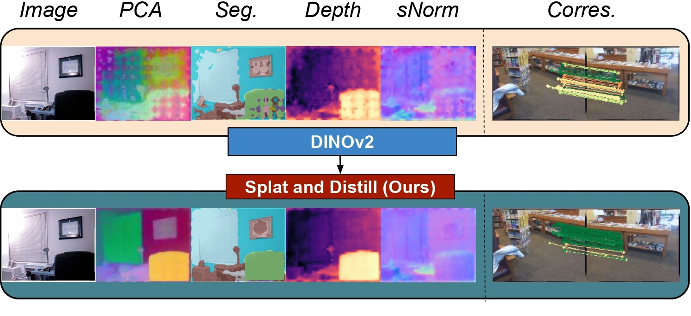

# SPLAT AND DISTILL: Augmenting Teachers with Feed-Forward 3D Reconstruction for 3D-Aware Distillation

**Accepted to ICLR 2026**

[**David Shavin**](https://davidshavin4.github.io/)<sup>1</sup>, [**Sagie Benaim**](https://sagiebenaim.github.io/)<sup>1</sup>

<sup>1</sup>The Hebrew University of Jerusalem

[**Project Page**](https://davidshavin4.github.io/Splat-and-Distill/) | [**Paper**](https://arxiv.org/abs/2602.06032) | [**Hugging Face**](https://huggingface.co/papers/2602.06032) | [**Model Weights**](https://huggingface.co/david-shavin/SnD) | [**Medium**](#)

---

<p align="center">
  
</p>

---

## 📌 Overview

**Splat and Distill (SnD)** is a fine-tuning pipeline that enhances 3D awareness in Vision Foundation Models (VFMs).

---

> 🚧 **Work in Progress:** This repository is under active development. The current codebase is a partial release. We are working on cleaning and documenting the remaining modules, which will be uploaded shortly.

---

## 🛠️ Development Status

- [x] Adding installation documentation
- [x] Providing pre-trained checkpoints for DINOv2-based aligners
- [x] Releasing the full training pipeline
- [ ] Adding evaluation code
- [ ] Provide better instruction for data download

---

## 🏋️ Weights

SnD weights are available on [Hugging Face](https://huggingface.co/david-shavin/SnD).

### Using Pre-trained Weights

Load the weights directly using PyTorch Hub. _Note: we offer two versions for the model weights, w/o blending, depending on the task. See details on model cards._

```python
import torch
import timm

# Download weights from Hugging Face
url = "https://huggingface.co/david-shavin/SnD/resolve/main/dinov2_small_snd.pth"
state_dict = torch.hub.load_state_dict_from_url(url, map_location='cpu')

# Load into timm model
model = timm.create_model(
    "vit_small_patch14_dinov2.lvd142m",
    pretrained=True,
    num_classes=0,
    dynamic_img_size=True,
    dynamic_img_pad=False,
)
model.load_state_dict(state_dict, strict=False)
```

---

## 📁 Dataset Structure

Create the following directory structure under your working directory:

```
datasets/
└── scannetpp/
    ├── metadata/
    │   ├── nvs_sem_train.txt
    │   ├── nvs_sem_val.txt
    │   ├── pretrained_feat_gaussians_train.pth
    │   ├── pretrained_feat_gaussians_val.pth
    │   ├── train_samples.txt
    │   ├── train_view_info.npy
    │   ├── val_samples.txt
    │   └── val_view_info.npy
    └── scenes/
        ├── {scene_id_0}/
        │   ├── images/
        │   ├── instance_segmentation/
        │   ├── points3d.ply
        │   ├── points3D.txt
        │   └── transforms_train.json
        ├── {scene_id_1}/
        └── ...
```

- Segmentation masks should match image filenames, extracted with [SAM](https://github.com/facebookresearch/segment-anything) or downloaded from [ScanNet++](https://kaldir.vc.in.tum.de/scannetpp/).

---

## ⚙️ Setup Instructions

1. **Environment Setup**

   - Follow the environment setup instructions from [MVSplat](#), **but do not download the rasterizer from MVSplat**.
   - Instead, download and install the Ludvig rasterizer, which supports feature rendering:
     - [Ludvig Rasterizer](https://github.com/naver/ludvig/tree/main/gaussiansplatting/submodules)
   - **Important:** Before installing, modify the number of embeddings to rasterize (e.g., 384 for DINOv2-Small) in [`apply_weights.cu`](https://github.com/naver/ludvig/blob/main/gaussiansplatting/submodules/diff-gaussian-rasterization/cuda_rasterizer/apply_weights.cu).

2. **Pretrained Models**
   - Download `re10k.ckpt` from [MVSplat](#) and save it to `checkpoints/`.
   - Download the backbone pretrained weight from [Unimatch](https://s3.eu-central-1.amazonaws.com/avg-projects/unimatch/pretrained/gmdepth-scale1-resumeflowthings-scannet-5d9d7964.pth) and save to `checkpoints/`:
     ```sh
     wget 'https://s3.eu-central-1.amazonaws.com/avg-projects/unimatch/pretrained/gmdepth-scale1-resumeflowthings-scannet-5d9d7964.pth' -P checkpoints
     ```

---

## 🚀 Training

Example command to start training:

```sh
python -m src.main +experiment=scannetpp.yaml data_loader.train.batch_size=1 checkpointing.load=checkpoints/re10k.ckpt checkpointing.resume=false model/vit=dinov2s
```

---

## 🔍 Evaluation

We provide two separate evaluation setups, each requiring its own conda environment:

- **Environment 1**: Semantic Segmentation & Depth Estimation
- **Environment 2**: Surface Normal Estimation & Multi-view Correspondence (coming soon)

---

## Part 1: Semantic Segmentation & Depth Estimation

This section focuses on semantic segmentation and depth estimation evaluation.

### Setup

We follow the environment setup from [FiT3D](https://github.com/Yue-0/FiT3D). Install the required dependencies:

```bash
# Create conda environment
conda create -n fit3d python=3.10
conda activate fit3d
pip install torch==2.0.0 torchvision==0.15.1 --index-url https://download.pytorch.org/whl/cu118
cd evaluation1
pip install -r requirements.txt
conda install -c "nvidia/label/cuda-11.8.0" cuda-toolkit
```

### Install mmcv and mmsegmentation

```bash
cd mmcv
MMCV_WITH_OPS=1 pip install . --no-build-isolation -v
cd ../mmsegmentation
pip install -e . -v
```

### Environment Variables

Set the following environment variables before running evaluations:

```bash
# Set library path for CUDA libraries
export LD_LIBRARY_PATH=$CONDA_PREFIX/lib:$CONDA_PREFIX/targets/x86_64-linux/lib

# Set Python path for mmcv and mmsegmentation
export PYTHONPATH=$(pwd)/mmcv:$(pwd)/mmsegmentation:$PYTHONPATH
```

### Running Evaluations

```bash
# Move back to evaluation1 directory
cd ..
```

#### Semantic Segmentation (ScanNet++)

```bash
python linear_evaluate_segmentation.py \
    --backbone-type dinov2_small_snd \
    evaluation/baseline_configs/vits_scannetpp_sem_linear_config.py \
    --work-dir work_dirs/baseline_segmentation_eval/scannetpp/dinov2s \
    --eval_baseline
```

#### Depth Estimation (ScanNet++)

```bash
python linear_evaluate_depth.py \
    --backbone-type dinov2_small_snd \
    evaluation/baseline_configs/vits_scannetpp_depth_linear_config.py \
    --work-dir work_dirs/baseline_depth_eval/scannetpp/dinov2s \
    --eval_baseline
```

---

## Part 2: surface normal estimation & mutliview correspondence (Coming soon..)

## 🔗 Useful Links

- [Fit3D](https://github.com/ywyue/FiT3D/tree/main)
- [Probe3D](https://github.com/mbanani/probe3d/tree/main)
- [MVSplat](https://github.com/donydchen/mvsplat)
- [Ludvig Rasterizer](https://github.com/naver/ludvig/tree/main/gaussiansplatting/submodules)
- [ScanNet++](https://kaldir.vc.in.tum.de/scannetpp/)
- [SAM](https://github.com/facebookresearch/segment-anything)
- [Unimatch Pretrained Weights](https://s3.eu-central-1.amazonaws.com/avg-projects/unimatch/pretrained/gmdepth-scale1-resumeflowthings-scannet-5d9d7964.pth)

---

## 🙌 Acknowledgement

This repository is based on [MVSplat](https://github.com/donydchen/mvsplat), [Fit3D](https://github.com/ywyue/FiT3D/tree/main), and [Probe3D](https://github.com/mbanani/probe3d/tree/main). We would like to thank the authors of these works for publicly releasing their code.

---

## Citation

If you find this work useful, please consider citing:

```bibtex
@article{shavin2026splat,
  title={Splat and Distill: Augmenting Teachers with Feed-Forward 3D Reconstruction For 3D-Aware Distillation},
  author={Shavin, David and Benaim, Sagie},
  journal={arXiv preprint arXiv:2602.06032},
  year={2026}
}
```
